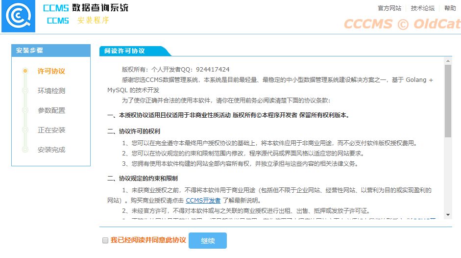
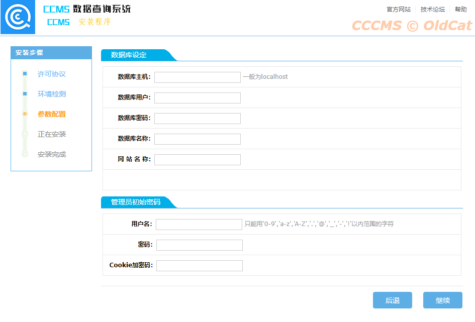
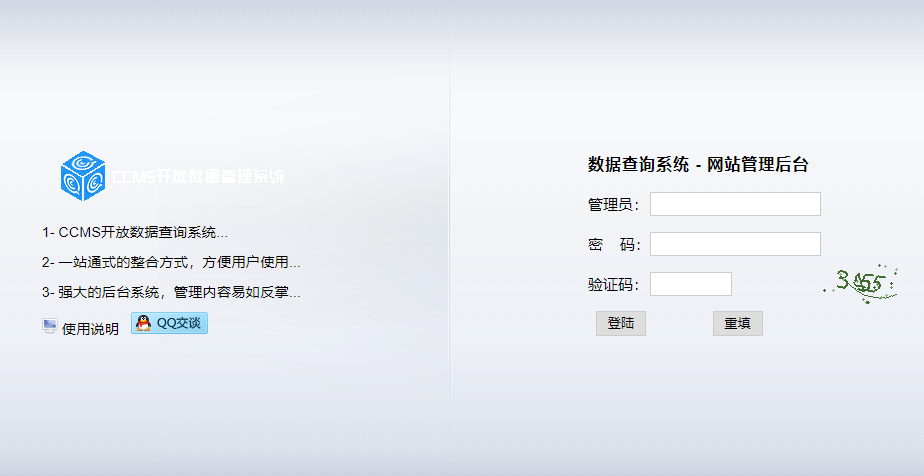
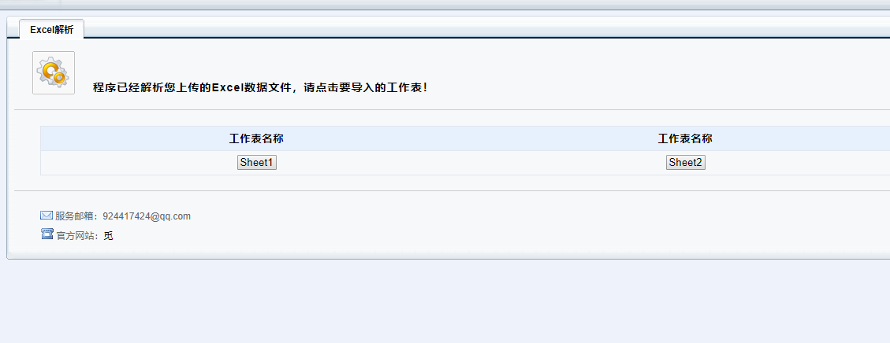
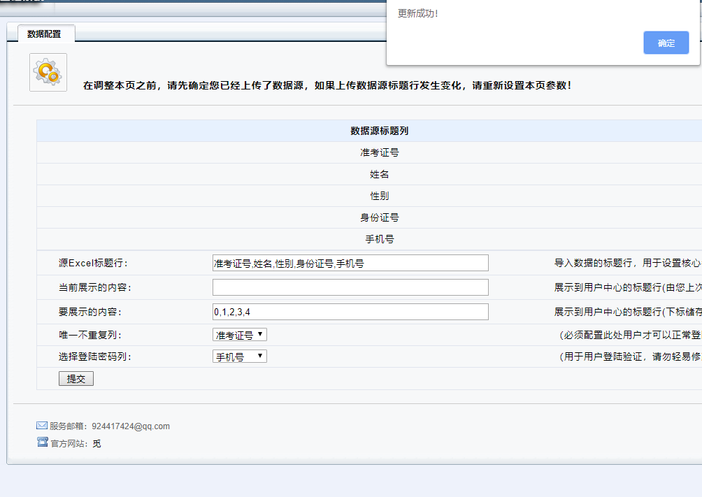
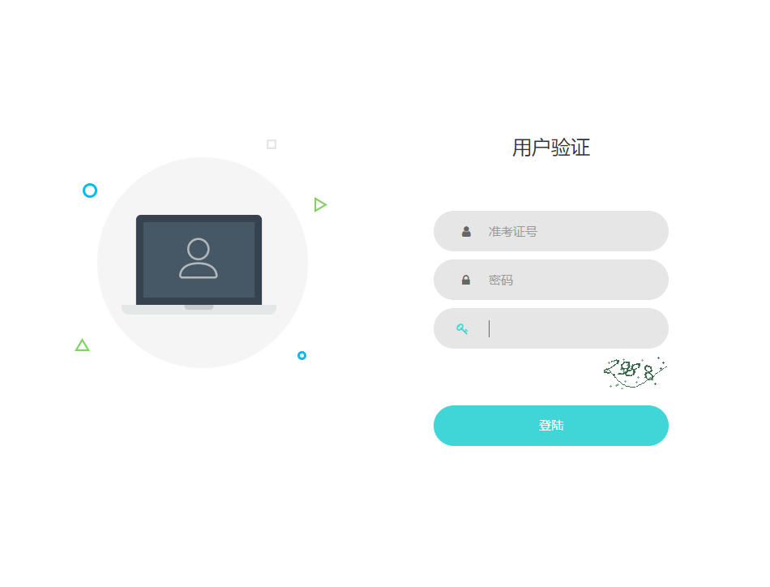
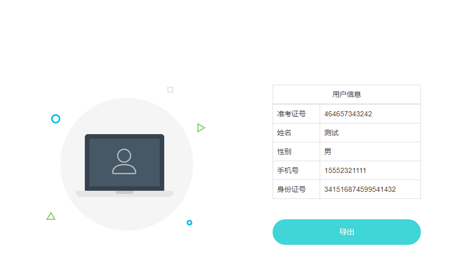

# CCMS系统

#### 介绍
CCMS是一个开放数据查询的CMS工具，使用Glang+Beego开发

#### 环境要求
    Linux/Windows

    Mysql
    

#### 安装教程

[Linux环境下Mysql安装教程](https://blog.csdn.net/andyzhaojianhui/article/details/82699309)

[windows环境下可直接安装phpstydy集成环境](https://blog.csdn.net/xiaopingga/article/details/79493727)

#### 使用说明

+ 如果您需要使用本程序，您可能会需要记住以下几点：
   + 本程序默认运行在8081端口，如修改程序运行端口请打开**conf/app.conf**文件修改**httpport = 8081** 字段并重启程序
   + 首次运行本程序，请运行服务端并访问程序于您服务器运行的端口进行安装
   + 运行本程序需要Mysql数据库支持，如果程序提示数据库连接失败，请确保您的数据库处于正常状态并可以进行连接
   + 如需要重新运行本程序，请删除**conf/config.ini**文件，并重启程序，重新进行安装
   + 本程序一般情况下您只需要修改运行端口，并保证服务器防火墙开放此端口
   + 关于程序的更多信息，请查看  CCMS系统使用说明.docx
   
#### 参与贡献&授权说明

*本程序由OldCat个人开发，未经授权允许，请勿修改程序代码，并不得用于任何商业性质的活动*

*如您对本程序有更好的建议请联系作者QQ：924417424*

[点这里在GitHub上找到本项目](https://github.com/t924417424/CCMS)